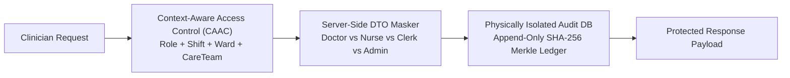

# Introduction & Problem Statement

Electronic Medical Record (EMR) systems are the core operational foundation of modern healthcare facilities. However, traditional hospital EMRs are vulnerable to catastrophic insider privacy violations and external cybersecurity threats.

---

## The Healthcare Security Trilemma

::alert{type="warning"}
Over 80% of unauthorized electronic Protected Health Information (ePHI) breaches originate from **insider curiosity and unsegmented lateral privilege escalation** rather than external perimeter breaches.
::

### 1. Insider Snooping & Lateral Movement (BOLA / IDOR)
In conventional EMR systems, once a healthcare worker (e.g., a nurse or physician) is authenticated, their role grants blanket read permissions to all patient charts across the entire hospital. A cardiology doctor can freely browse records of VIP patients in psychiatry, or a ward clerk can view confidential psychiatric notes.

### 2. Excessive Data Exposure (OWASP API3)
Traditional single-page application (SPA) architectures transmit full patient JSON objects containing sensitive clinical diagnoses, progress notes, and psychiatric history over the wire, relying on frontend client UI code (`v-if`) to hide confidential fields. Any malicious user can open DevTools Network tab and view raw, unmasked ePHI.

### 3. Ransomware Audit Log Destruction
When a hospital's primary relational database is compromised, attackers or rogue database administrators frequently execute `TRUNCATE` or `DELETE` commands on audit tables to erase forensic footprints, preventing post-incident remediation and HIPAA breach accountability.

---

## Avecinna Core Value Proposition

Avecinna resolves this trilemma by introducing a **Zero-Trust, Context-Aware Security Architecture**:

1. **Context-Aware Access Control (CAAC):**  
   Every patient chart access requires a dynamic intersection of:
   - **Valid Role:** The user has legitimate clinical credentials.
   - **Active Shift Window:** The request timestamp falls within an authorized roster schedule.
   - **Direct Clinical Context:** The clinician is either assigned to the patient's active ward, is on the active multidisciplinary care team, or has an outpatient appointment scheduled today.
   - **Emergency Break-Glass:** Authorized override during cardiac arrest or severe trauma with mandatory post-incident audit rationale.

2. **Server-Side Role DTO Masking:**  
   The backend serializes strictly scoped response DTOs *before* data crosses the network boundary, ensuring that Clerks never receive clinical notes and System Admins are strictly prohibited from viewing patient medical data (`[REDACTED - ADMIN PRIVACY RESTRICTION]`).

3. **Isolated Cryptographic Merkle Audit Ledger:**  
   Every access attempt (both permitted and blocked) is written to a physically isolated database (`avecinna_audit_db`) using SHA-256 sequential hash chaining and Merkle trees, rendering audit logs tamper-evident and immune to primary database destruction.

---

## Next Steps

- Proceed to [Quick Start Guide](/getting-started/quick-start) to boot up Avecinna locally.
- Review the [Architecture Overview](/getting-started/architecture-overview) for detailed component blueprints.
