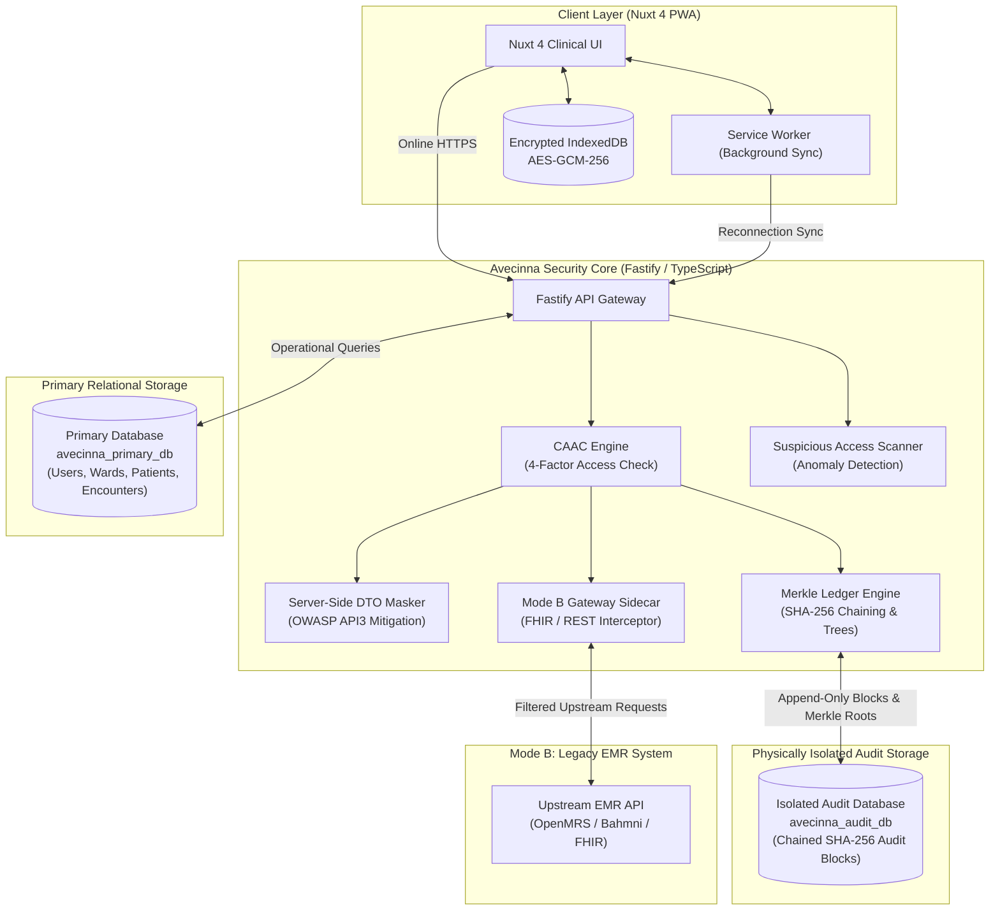

# System Architecture Overview

Avecinna is engineered from the ground up as a **Dual-Database, Zero-Trust Clinical Record System** capable of operating in three complementary modes.

---

## 1. High-Level Component Flowchart

---

## 2. Component Responsibilities

| Component | Technology | Primary Responsibilities |
| :--- | :--- | :--- |
| **Nuxt 4 Frontend** | Nuxt 4, Vue 3, TailwindCSS | Clinical dashboard rendering, ward switching, Break-Glass modals, Care Team management, and SVG Merkle visualization. |
| **Service Worker** | Web Service Worker API | Network status monitoring, background mutation synchronization, and offline cache management. |
| **Local Client Storage** | IndexedDB + Web Crypto API | Local encryption at rest using AES-GCM-256 keys derived from user session keys. |
| **Fastify API Server** | Fastify, TypeScript | High-throughput REST API with strict JSON Schema request validation. |
| **CAAC Engine** | TypeScript Service | Dynamic 4-factor authorization evaluation: Role + Shift + Ward + Care Team / Break-Glass. |
| **Server-Side DTO Masker** | TypeScript Service | Strips unauthorized JSON fields before data leaves the server (Doctor, Nurse, Clerk, Pharmacist, Admin). |
| **Cryptographic Merkle Engine** | Node.js `crypto` (SHA-256) | Computes sequential block hashes, binary Merkle tree roots, and Git-style DAG offline branch merges. |
| **Suspicious Access Scanner** | Background Scan Worker | Real-time rule-based anomaly detection for rapid ward hopping, expired consult queries, and excessive Tier-2 break-glass usage. |
| **Primary Relational DB (`avecinna_primary_db`)** | PostgreSQL + Drizzle ORM | Stores operational clinical tables (Users, Wards, Ward Rosters, Patients, Encounters, Vitals, Care Teams, Security Alerts). |
| **Isolated Audit DB (`avecinna_audit_db`)** | PostgreSQL + Drizzle ORM | **Physically isolated, append-only database** storing chained SHA-256 audit blocks with dual-parent merge nodes. Protected by write-only credentials. |

---

## 3. The Dual-Database Isolation Principle

::alert{type="danger"}
**Why Dual Databases?**  
In traditional monolithic EMR databases, a compromised administrative account or SQL injection exploit can wipe both clinical data and audit history simultaneously (`DROP TABLE audit_logs`).
::

To solve this, Avecinna enforces strict database separation:
1. **Primary Database (`avecinna_primary_db`)**: Operates standard Read/Write/Update transactional workflows for clinical care.
2. **Audit Database (`avecinna_audit_db`)**: Dedicated exclusively to append-only cryptographic audit blocks. It contains **no raw clinical text** (only SHA-256 payload hashes) and is accessible only via write-only audit credentials.
