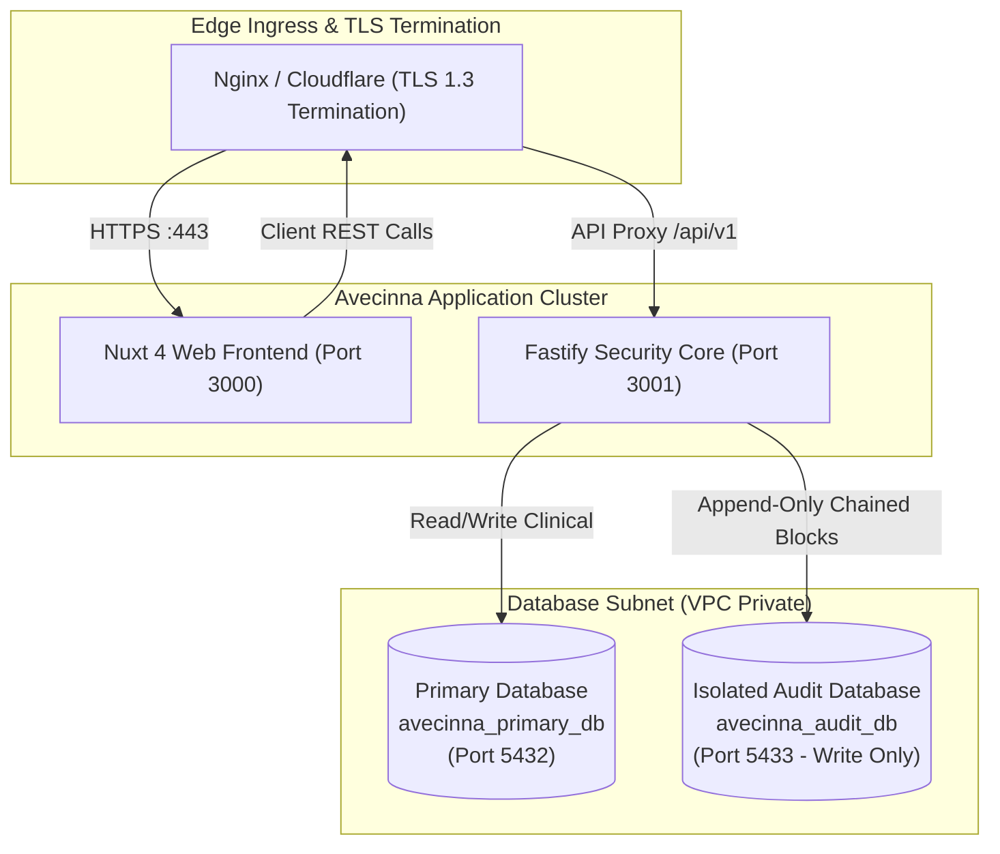

# Production Deployment Guide

This guide covers deploying Avecinna to high-availability production environments using Docker Compose or Kubernetes.

---

## 1. Production Container Topology



---

## 2. Docker Compose Production Configuration

```yaml
version: '3.8'

services:
  frontend:
    build:
      context: ./frontend
      dockerfile: Dockerfile
    restart: always
    environment:
      - NUXT_PUBLIC_API_BASE=https://avecinna-backend.vitalsdeck.com.ng/api/v1
    ports:
      - "3000:3000"

  backend:
    build:
      context: ./backend
      dockerfile: Dockerfile
    restart: always
    environment:
      - DATABASE_URL=postgres://primary_user:StrongPassword1@db_primary:5432/avecinna_primary_db
      - AUDIT_DATABASE_URL=postgres://audit_writer:StrongPassword2@db_audit:5432/avecinna_audit_db
      - JWT_SECRET=${JWT_SECRET}
      - PORT=3001
      - CORS_ORIGIN=https://avecinna.vitalsdeck.com.ng
    ports:
      - "3001:3001"
    depends_on:
      - db_primary
      - db_audit

  db_primary:
    image: postgres:16-alpine
    restart: always
    environment:
      - POSTGRES_DB=avecinna_primary_db
      - POSTGRES_USER=primary_user
      - POSTGRES_PASSWORD=StrongPassword1
    volumes:
      - primary_data:/var/lib/postgresql/data

  db_audit:
    image: postgres:16-alpine
    restart: always
    environment:
      - POSTGRES_DB=avecinna_audit_db
      - POSTGRES_USER=audit_writer
      - POSTGRES_PASSWORD=StrongPassword2
    volumes:
      - audit_data:/var/lib/postgresql/data

volumes:
  primary_data:
  audit_data:
```

---

## 3. Database Hardening & Write-Only Audit Role

To ensure forensic immutability, configure PostgreSQL permissions on `avecinna_audit_db` so the backend application can **only INSERT** and **SELECT** audit blocks, but is **strictly prohibited from UPDATE or DELETE operations**:

```sql
-- Connect to avecinna_audit_db
REVOKE UPDATE, DELETE, TRUNCATE ON audit_blocks FROM audit_writer;
GRANT INSERT, SELECT ON audit_blocks TO audit_writer;
```
