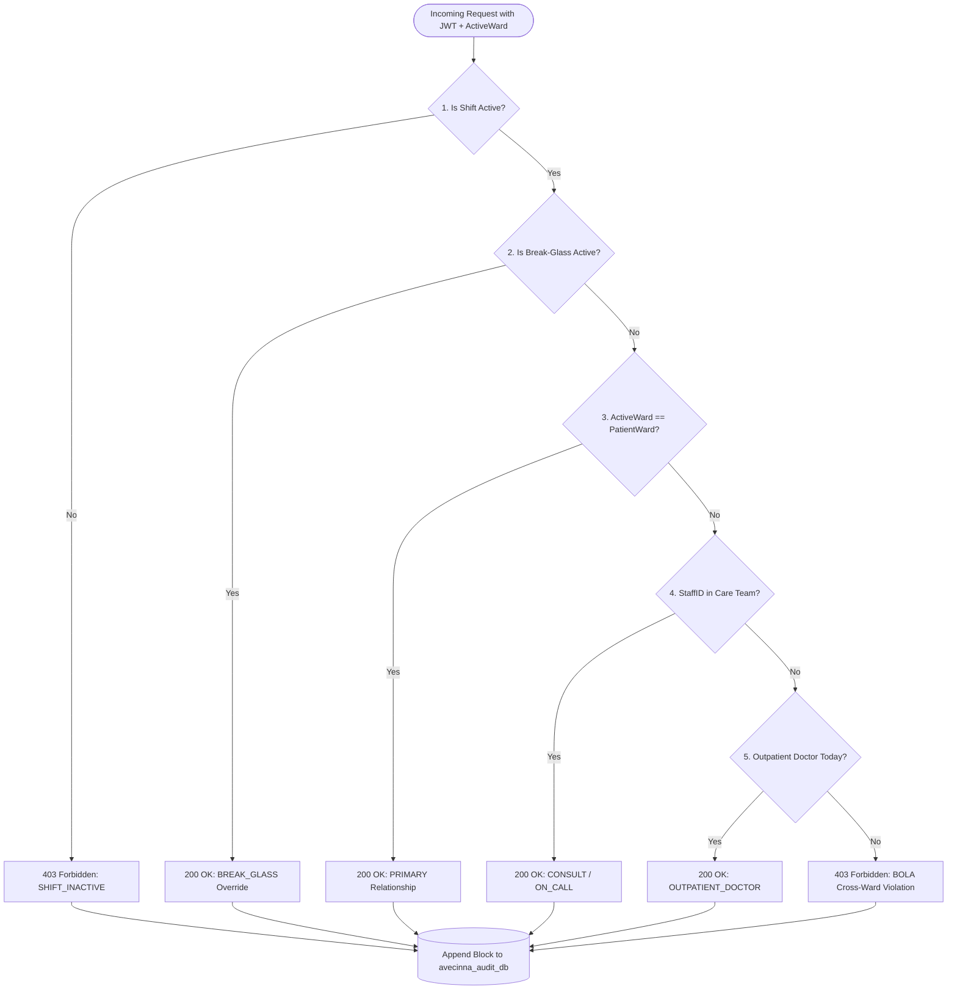

# Context-Aware Access Control (CAAC)

The **Context-Aware Access Control (CAAC)** engine is the central authorization authority in Avecinna. Unlike traditional static Role-Based Access Control (RBAC), CAAC computes real-time dynamic access decisions at request execution time.

---

## 1. Mathematical Authorization Formula

Access to any patient clinical record is governed by the formal Boolean equation:

$$\text{Permit} = \text{RoleValid} \land \text{ShiftActive} \land \left( (\text{ActiveWard} == \text{PatientWard}) \lor (\text{StaffID} \in \text{PatientCareTeam}) \lor \text{OutpatientDoctorToday} \lor \text{BreakGlassActive} \right)$$

::caac-simulator
::

---

## 2. Decision Logic Breakdown



### Component Evaluations
1. **Shift Active Check (`ShiftActive`):**  
   Evaluates whether the current request timestamp falls between `shiftStart` and `shiftEnd`. Requests made outside scheduled hours are rejected immediately.
2. **Break-Glass Emergency Check (`BreakGlassActive`):**  
   Emergency clinicians can invoke Tier 1 or Tier 2 Break-Glass to immediately bypass ward boundaries during code blue / trauma scenarios.
3. **Ward Equality Check (`ActiveWard == PatientWard`):**  
   Grants access if the clinician's active session ward matches the patient's assigned primary ward (`patients.primary_ward_id`).
4. **Care Team Membership Check (`StaffID in PatientCareTeam`):**  
   Queries `care_teams` table for non-expired consult, on-call, or multidisciplinary care team relationships (`expires_at >= NOW()`).
5. **Outpatient Consultation Check (`OutpatientDoctorToday`):**  
   Queries `outpatient_appointments` for active appointments scheduled with the requesting physician for the current calendar date.

---

## 3. Implementation in Codebase

The CAAC logic is encapsulated in [`backend/src/services/caacEngine.ts`](file:///home/ahmadbb/Documents/avecinna/backend/src/services/caacEngine.ts):

```typescript
export async function evaluateCAAC(input: CAACInput): Promise<CAACResult> {
  const { userId, role, activeWardId, patientId, shiftStart, shiftEnd, isBreakGlass } = input;

  // 1. Validate Shift Window
  if (shiftStart && shiftEnd) {
    const now = new Date();
    if (now < new Date(shiftStart) || now > new Date(shiftEnd)) {
      return { isPermitted: false, denialReason: 'SHIFT_INACTIVE' };
    }
  }

  // 2. Fetch Patient Record
  const [patient] = await dbPrimary.select().from(patients).where(eq(patients.id, patientId)).limit(1);
  if (!patient) return { isPermitted: false, denialReason: 'PATIENT_NOT_FOUND' };

  // 3. Emergency Break-Glass Override
  if (isBreakGlass) return { isPermitted: true, relationshipType: 'BREAK_GLASS', patient };

  // 4. Ward Equality Check
  if (patient.primaryWardId === activeWardId) {
    return { isPermitted: true, relationshipType: 'PRIMARY', patient };
  }

  // 5. Care Team Relationship Check
  const careTeamMatches = await dbPrimary.select().from(careTeams).where(
    and(
      eq(careTeams.patientId, patientId),
      eq(careTeams.staffId, userId),
      or(isNull(careTeams.expiresAt), gte(careTeams.expiresAt, new Date()))
    )
  ).limit(1);

  if (careTeamMatches.length > 0) {
    return { isPermitted: true, relationshipType: careTeamMatches[0].relationshipType, patient };
  }

  // 6. Outpatient Appointment Check
  // ... checks outpatient_appointments for today's date

  // 7. Reject Cross-Ward BOLA Access
  return { isPermitted: false, denialReason: 'NO_WARD_OR_CARE_TEAM_RELATIONSHIP' };
}
```
