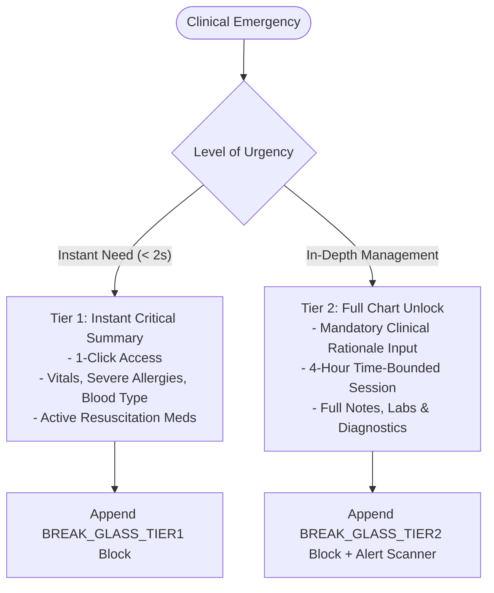

# Emergency Break-Glass Protocol

In clinical emergencies (e.g., Cardiac Arrest, Traumatic Brain Injury, Anaphylactic Shock), strict ward-boundary access controls must not delay life-saving medical care.

Avecinna provides a **Two-Tier Emergency Break-Glass Architecture** that balances instant clinical utility with rigorous forensic accountability.

---

## 1. Two-Tier Break-Glass Taxonomy



### Tier 1: Instant Emergency Summary
- **Target Use Case:** Immediate resuscitation, Code Blue, rapid triage.
- **Latency:** Instant (1 click, `< 500ms`).
- **Data Unlocked:** Blood Type, Severe Drug Allergies, Recent Vitals, Active Emergency Medications.
- **Endpoint:** `POST /api/v1/patients/:id/break-glass/tier1`

### Tier 2: Full Chart Emergency Unlock
- **Target Use Case:** Comprehensive emergency surgery, complex polytrauma management.
- **Requirements:** Mandatory clinical justification (min. 10 characters) and acknowledgment of audit tracking.
- **Duration:** 4-hour time-bounded access window.
- **Endpoint:** `POST /api/v1/patients/:id/break-glass/tier2`

---

## 2. Anti-Abuse Rate Limiting & Throttling

To prevent clinicians from using Tier-2 Break-Glass as a casual workaround for legitimate consult requests, the backend enforces:
- **Maximum 3 Tier-2 activations per clinician per shift.**
- Real-time notification to the hospital **Information Security Officer (ISO)** for every Tier-2 activation.
- Flagging by the [Suspicious Access Scanner](/core-security-engine/suspicious-access-scanner) if multiple activations occur across unrelated wards.

---

## 3. Cryptographic Audit Footprint

When a Break-Glass event is triggered, a high-priority block is immediately sealed into `avecinna_audit_db`:

```json
{
  "action": "BREAK_GLASS_TIER2",
  "userId": "u-doc-cardio",
  "patientId": "p-peds-01",
  "activeWard": "w-cardio",
  "payloadHash": "e3b0c44298fc1c149afbf4c8996fb92427ae41e4649b934ca495991b7852b855",
  "deviceInfo": "Emergency Department Workstation #3",
  "executionMode": "MODE_A",
  "justification": "Patient in cardiac arrest during cross-ward transfer. Immediate intubation and drug allergy check required."
}
```
