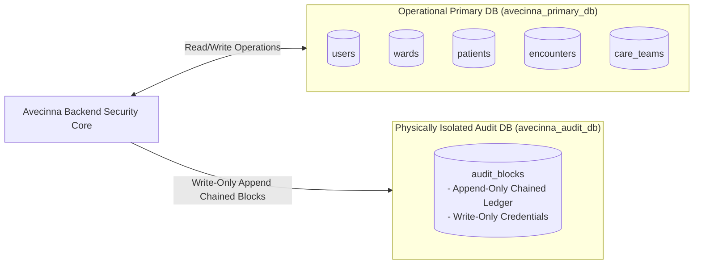

# Isolated Audit Database Architecture

The Avecinna audit subsystem is physically isolated in a dedicated PostgreSQL database (`avecinna_audit_db`) to guarantee forensic non-repudiation and prevent ransomware attackers from wiping audit records after compromising operational data.

---

## 1. Dual-Database Topology



---

## 2. Zero-ePHI Privacy Preservation

::alert{type="info"}
**Privacy Rule:** Electronic Protected Health Information (ePHI) such as patient names, clinical notes, and diagnosis strings **must never be stored in plain text inside audit blocks**.
::

Instead of storing raw payloads, Avecinna computes a deterministic SHA-256 hash of the response JSON payload:

$$\text{payloadHash} = \text{SHA256}(\text{JSON.stringify}(\text{payload}))$$

This cryptographic technique guarantees two properties:
1. **Mathematical Proof of Content Integrity:** Anyone holding the original patient record can prove that the server transmitted exactly that data at that timestamp.
2. **Zero-Knowledge Privacy:** An attacker or database auditor inspecting `avecinna_audit_db` cannot reconstruct patient medical information from the audit ledger.

---

## 3. Database Schema (`audit_blocks`)

```sql
CREATE TABLE audit_blocks (
    index_num BIGSERIAL PRIMARY KEY,
    block_hash VARCHAR(64) NOT NULL UNIQUE,
    prev_hash VARCHAR(64) NOT NULL,
    user_id VARCHAR(36) NOT NULL,
    patient_id VARCHAR(36),
    action VARCHAR(50) NOT NULL,
    active_ward VARCHAR(36) NOT NULL,
    relationship_type VARCHAR(20),
    payload_hash VARCHAR(64) NOT NULL,
    ip_address VARCHAR(45) NOT NULL,
    user_agent VARCHAR(500),
    device_type VARCHAR(30) DEFAULT 'DESKTOP',
    device_info VARCHAR(150),
    http_method VARCHAR(10),
    request_path VARCHAR(255),
    execution_mode VARCHAR(20) DEFAULT 'MODE_A',
    offline_parent_hash VARCHAR(64),
    offline_ward_id VARCHAR(36),
    merkle_root_id VARCHAR(64),
    is_reconciled BOOLEAN DEFAULT FALSE,
    request_id VARCHAR(64),
    timestamp TIMESTAMP WITH TIME ZONE DEFAULT CURRENT_TIMESTAMP
);
```
