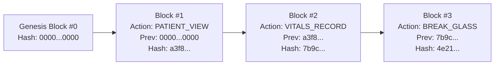

# Sequential SHA-256 Hash Chain

Every transaction, chart access, ward switch, and Break-Glass event sealed by Avecinna forms a link in an unbroken, sequentially chained cryptographic ledger.

---

## 1. Block Hash Cryptographic Construction

Each block's hash incorporates the cryptographic signature of the preceding block (`prev_hash`) alongside the full context of the access event:

$$\text{BlockHash}_k = \text{SHA256}(\text{prev\_hash}_{k-1} \mid \text{user\_id} \mid \text{patient\_id} \mid \text{action} \mid \text{ward} \mid \text{payload\_hash} \mid \text{ip} \mid \text{timestamp})$$



---

## 2. Real-Time O(1) Block Sealing

When an event occurs in the backend, [`backend/src/services/merkleEngine.ts`](file:///home/ahmadbb/Documents/avecinna/backend/src/services/merkleEngine.ts) fetches the tail block hash and appends the new sealed record in $O(1)$ constant time:

```typescript
export async function appendAuditBlock(event: AuditEventInput) {
  // 1. Fetch latest block to get tail prev_hash
  const latestBlock = await dbAudit
    .select({ blockHash: auditBlocks.blockHash, indexNum: auditBlocks.indexNum })
    .from(auditBlocks)
    .orderBy(desc(auditBlocks.indexNum))
    .limit(1);

  const prevHash = latestBlock.length > 0 ? latestBlock[0].blockHash : GENESIS_HASH;
  const timestamp = new Date().toISOString();

  // 2. Compute current block SHA-256
  const rawString = `${prevHash}|${userId}|${patientId}|${action}|${activeWard}|${payloadHash}|${ipAddress}|${timestamp}`;
  const blockHash = crypto.createHash('sha256').update(rawString).digest('hex');

  // 3. Insert into isolated audit DB
  await dbAudit.insert(auditBlocks).values({
    blockHash,
    prevHash,
    userId,
    patientId,
    action,
    activeWard,
    payloadHash,
    ipAddress,
    userAgent,
    timestamp: new Date(timestamp),
  });

  return { blockHash, prevHash };
}
```

---

## 3. Continuous Ledger Chain Verification

The audit engine exposes `POST /api/v1/audit/verify` to perform full-chain verification. If an adversary attempts to modify a historical block, the hash cascade immediately invalidates all subsequent links, pinpointing the exact `tamperedBlockIndex`.
