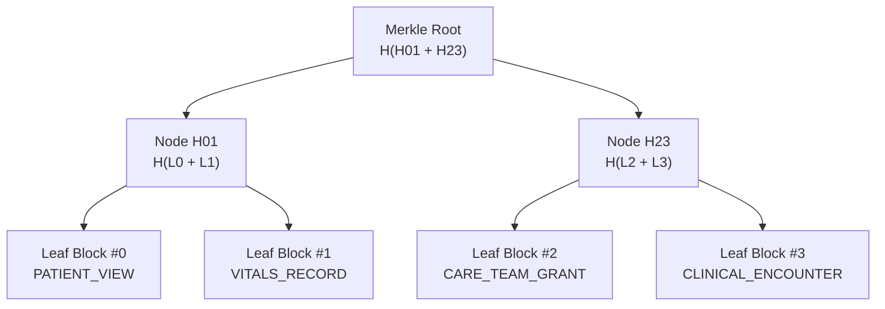

# Binary Merkle Trees & Tamper Proofs

While sequential hash chains provide $O(1)$ real-time appending, **Binary Merkle Trees** enable logarithmic $O(\log N)$ inclusion verification and periodic cryptographic root anchoring.

---

## 1. Merkle Tree Architecture

::merkle-tree-demo
::

A Merkle Tree aggregates $N$ audit leaf hashes into a single 32-byte **Merkle Root**:



---

## 2. Generating Merkle Inclusion Proofs (O(log N))

To prove to a compliance regulator or external auditor that a specific patient record access event occurred at an exact timestamp without exposing other confidential audit blocks, Avecinna generates a **Merkle Audit Inclusion Proof**:

```typescript
export function generateMerkleProof(leaves: string[], targetIndex: number) {
  const proof: { position: 'left' | 'right'; hash: string }[] = [];
  let currentIndex = targetIndex;
  let currentLevel = [...leaves];

  while (currentLevel.length > 1) {
    const nextLevel: string[] = [];
    for (let i = 0; i < currentLevel.length; i += 2) {
      const left = currentLevel[i];
      const right = i + 1 < currentLevel.length ? currentLevel[i + 1] : left;

      if (i === currentIndex || i + 1 === currentIndex) {
        if (currentIndex % 2 === 0) {
          proof.push({ position: 'right', hash: right });
        } else {
          proof.push({ position: 'left', hash: left });
        }
      }
      nextLevel.push(crypto.createHash('sha256').update(left + right).digest('hex'));
    }
    currentIndex = Math.floor(currentIndex / 2);
    currentLevel = nextLevel;
  }

  return { root: currentLevel[0], proof };
}
```

---

## 3. Merkle Tree API Endpoints

- `GET /api/v1/audit/merkle/tree` — Retrieves structured hierarchical Merkle tree nodes for visual rendering.
- `POST /api/v1/audit/verify` — Computes full cryptographic verification across all block ranges.
