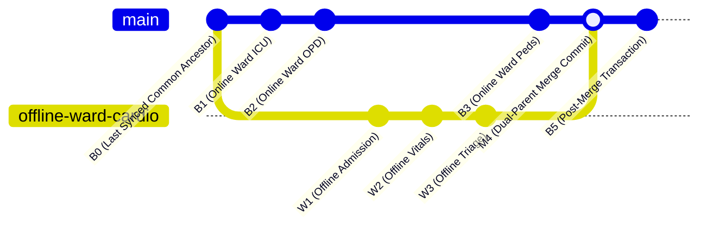

# Merkle DAG & Offline Ward Branch Merging

In hospital operations, a specific clinical ward (e.g., Rural Field Clinic, Submarine Sickbay, or Disaster Triage Tent) may experience prolonged network blackouts while continuing to admit patients and record vital signs locally.

Avecinna employs a **Merkle Directed Acyclic Graph (DAG)** with **Git-Style Dual-Parent Merge Commits** to reconcile offline audit branches without destroying cryptographic continuity.

---

## 1. The Offline Branching Problem

When a ward goes offline:
1. The Central Server continues accepting transactions from online wards (`Main Branch`: $B_0 \rightarrow B_1 \rightarrow B_2 \rightarrow B_3$).
2. The Offline Ward creates local audit blocks chained against the last known online block ($W_1 \rightarrow W_2 \rightarrow W_3$).

---

## 2. Dual-Parent Merge Commit Construction

Upon reconnection, the offline client transmits its array of offline audit blocks to `POST /api/v1/audit/reconcile-offline`.

The server creates a **Dual-Parent Merge Commit Block ($M_4$)**:
- `prev_hash`: Points to the current Central Mainline Tail ($B_3$).
- `offline_parent_hash`: Points to the Offline Ward Tail ($W_3$).
- `action`: `OFFLINE_WARD_MERGE`.
- `offline_ward_id`: Identifies the reconnected ward.

$$\text{MergeHash} = \text{SHA256}(\text{MainlineTail} \mid \text{OfflineWardTail} \mid \text{WardID} \mid \text{OFFLINE\_MERGE} \mid \text{Timestamp})$$

This mathematically binds the two historical branches together, preserving a single, verifiable, conflict-free audit DAG.
