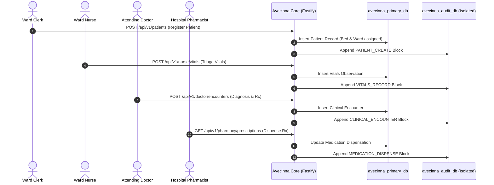

# Mode A: Standalone Secure EMR

**Mode A** is the full-stack, turn-key deployment of Avecinna, consisting of the **Nuxt 4 Frontend Workstation**, the **Fastify Security Core**, and the **Dual PostgreSQL Database Layer**.

---

## 1. End-to-End Clinical Flow

---

## 2. Supported Role Workspaces

- **Doctor Dashboard (`/doctor`)**: Clinical encounter recording, inpatient rounds, diagnostic lab orders, emergency Break-Glass activation, and multidisciplinary care team consult management.
- **Nurse Dashboard (`/nurse`)**: Vitals recording, telemetry monitoring, nursing care plan checklists, and active medication administration.
- **Clerk Dashboard (`/clerk`)**: Patient registration, bed reallocation, ward admissions, and outpatient appointment scheduling.
- **Pharmacy Dashboard (`/pharmacy`)**: Active prescription review, drug-allergy contraindication checks, and dispensation logging.
- **Head of Unit Workspace (`/unit`)**: Ward staff rosters, active inpatient census, and departmental consult assignment.
- **Admin Dashboard (`/admin`)**: User account provisioning, ward management, real-time security alerts, and cryptographic Merkle audit verification.
