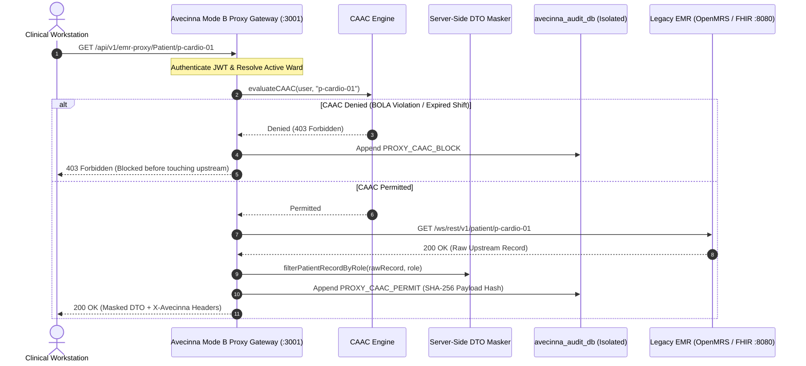

# Mode B: Zero-Trust Reverse Proxy Sidecar

Hospitals often run legacy or third-party EMR systems (e.g., OpenMRS, Bahmni, Epic, or standard HL7 FHIR servers) that lack context-aware authorization, server-side DTO masking, or immutable audit ledgers.

**Mode B** deploys Avecinna as a **Security Reverse Proxy Gateway Sidecar** (`backend/src/routes/proxy.ts`), intercepting all upstream clinical traffic without requiring code modifications to the legacy EMR.

---

## 1. Proxy Architecture & Interception Flow



---

## 2. Configuration & Route Mapping

Enable Mode B in `backend/.env`:

```ini
UPSTREAM_EMR_URL=https://openmrs.hospital.internal/ws/rest/v1
```

All incoming calls matching `/api/v1/emr-proxy/*` are dynamically routed to `UPSTREAM_EMR_URL/*` with:
- Upstream credentials / service tokens attached.
- Inbound headers (`X-User-Id`, `X-Active-Ward-Id`, `X-User-Role`) validated.
- Response payloads scrubbed through `filterPatientRecordByRole`.
- Outbound headers attached:
  - `X-Avecinna-Execution-Mode: MODE_B`
  - `X-Avecinna-Audit-Logged: true`
  - `X-Audit-Block-Hash: <sha256>`
