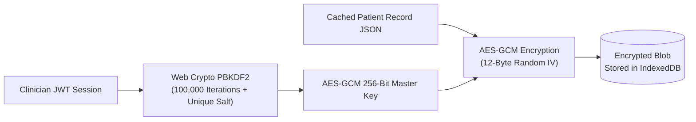

# Client-Side Web Crypto & IndexedDB

When a clinical workstation operates offline, cached patient cards and offline audit blocks stored inside the browser's **IndexedDB** must be protected from physical device theft or local file inspection.

Avecinna implements **Client-Side AES-GCM-256 Encryption at Rest** via `frontend/app/composables/useOfflineStorage.ts`.

---

## 1. Cryptographic Key Derivation Flow



---

## 2. Implementation with Web Crypto API

```typescript
// frontend/app/composables/useOfflineStorage.ts
export async function encryptData(plainText: string, key: CryptoKey): Promise<{ cipherText: string; iv: string }> {
  const iv = crypto.getRandomValues(new Uint8Array(12));
  const encoded = new TextEncoder().encode(plainText);

  const encrypted = await crypto.subtle.encrypt(
    { name: 'AES-GCM', iv },
    key,
    encoded
  );

  return {
    cipherText: btoa(String.fromCharCode(...new Uint8Array(encrypted))),
    iv: btoa(String.fromCharCode(...iv)),
  };
}
```

When the user logs out, the in-memory `CryptoKey` is wiped immediately from browser RAM, rendering the local IndexedDB database cryptographically unreadable.
