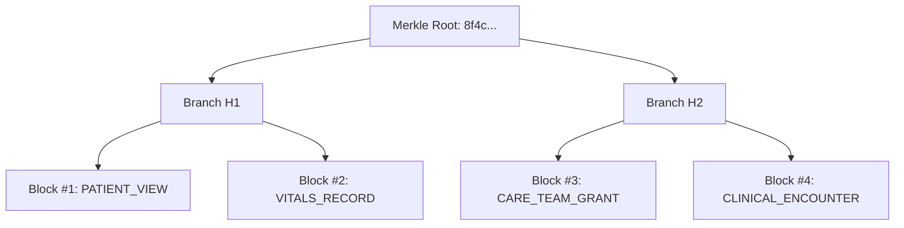

# Interactive Visualizers & Modals

Avecinna provides rich, real-time visual interfaces for inspecting complex cryptographic data structures and managing clinical emergency overrides.

---

## 1. Merkle Tree & Git DAG Visualizers (`/admin/audit`)

In the Admin Audit Workspace, compliance officers can toggle between:
- **Hierarchical Merkle Tree Visualizer:** An interactive SVG viewport rendering parent-child hash relationships with zoom, pan, and live block status indicators.
- **Git-Style DAG Visualizer:** Visualizes parallel offline ward branch forks and dual-parent merge commits ($M_4$) connecting to central mainline.

---

## 2. Clinical Emergency & Care Team Modals

- **`<BreakGlassModal />`**: Instant 1-click Tier 1 emergency summary unlock vs. Tier 2 full chart override with mandatory clinical justification text and warning indicators.
- **`<CareTeamModal />`**: Multidisciplinary staff selector with role filter pills (`All`, `Doctors`, `Nurses`, `Pharmacy`), search input, expiry date picker, and active consult revocation buttons.
