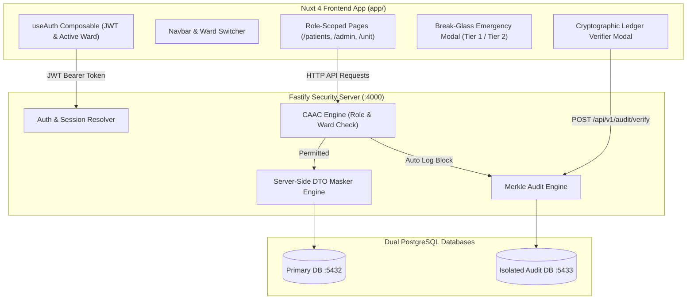

# Phase 4 Implementation Plan — Nuxt 4 Frontend PWA & Role-Scoped Clinical UI

This document outlines the technical architecture, component design, DTO rendering logic, and user workflow for **Phase 4: Nuxt 4 Frontend PWA & Dynamic Role-Scoped Clinical UI** for **Avecinna: Context-Aware Secure EMR**.

---

## 1. Executive Summary & Architectural Goals

The Phase 4 frontend will be built using **Nuxt 4** (using the new `app/` directory structure), **TailwindCSS 3** with Vite, and responsive SVG icons (no emoji icons as per guidelines). It provides a high-performance clinical interface tailored dynamically to user roles (`DOCTOR`, `NURSE`, `PARAMEDIC`, `CLERK`, `PHARMACIST`, `HEAD_OF_UNIT`, `ADMIN`).

### Key Features to Implement:
1. **Ward & Shift Context Header**: Real-time dropdown to switch active ward context, displaying shift countdown timers and role badges.
2. **Dynamic DTO Renderer**: Automatically renders appropriate UI sections according to the role-scoped JSON payload returned by the backend `dtoMasker.ts`:
   - **Doctor / Head of Unit**: Full clinical record, diagnoses, labs, medical documents.
   - **Nurse / Paramedic**: Vitals trend charts, active medications, allergy warnings, care plan.
   - **Clerk**: Demographics, admission date, bed allocation ONLY.
   - **Pharmacist**: Active prescriptions, medication administration history, allergy alerts ONLY.
   - **System Admin (`ADMIN`)**: Redacted clinical panel displaying explicit privacy banner (`[REDACTED - ADMIN PRIVACY RESTRICTION]`).
3. **Two-Tier Break-Glass Emergency Modal**:
   - **Tier 1**: Immediate 1-click summary for rapid triage.
   - **Tier 2**: Full record unlock requiring mandatory 10+ character justification, triggering security scanner alerts.
4. **Cryptographic Audit Ledger Verifier Widget**: Visual inspector for running real-time SHA-256 linear chain & Merkle Tree integrity checks against `avecinna_audit_db`.

---

## 2. System Architecture Diagram



---

## 3. User Review Required

> [!IMPORTANT]
> **Admin Privacy Redaction Visualization:**
> When logged in as `ADMIN`, querying any patient record will display an explicit security banner highlighting OWASP API3 compliance and explaining that clinical data is redacted for privacy.
>
> **Active Ward Switching:**
> Clinicians can switch active ward context from the header dropdown (`/api/v1/auth/switch-ward`). Changing active ward immediately re-evaluates CAAC authorization rules on patient records.

---

## 4. Proposed File Changes & Project Layout

```text
avecinna/
├── nuxt.config.ts                      # [NEW] Nuxt 4 configuration
├── app/
│   ├── app.vue                         # [NEW] Root layout & page wrapper
│   ├── assets/
│   │   └── css/
│   │       └── main.css                # [NEW] TailwindCSS 3 imports & global styles
│   ├── composables/
│   │   ├── useAuth.ts                  # [NEW] Authentication, token, active ward state
│   │   ├── usePatients.ts              # [NEW] Patient directory & detail fetching
│   │   └── useAudit.ts                 # [NEW] Ledger verification composable
│   ├── components/
│   │   ├── Navbar.vue                  # [NEW] Header with active ward selector & break-glass trigger
│   │   ├── RoleBadge.vue               # [NEW] Styled status badge for user roles
│   │   ├── AdminRedactionBanner.vue    # [NEW] Admin privacy warning banner
│   │   ├── BreakGlassModal.vue         # [NEW] Tier 1 & Tier 2 emergency break-glass modal
│   │   ├── AuditVerifierModal.vue      # [NEW] Ledger SHA-256 chain & Merkle tree verifier
│   │   ├── PatientCard.vue             # [NEW] Patient list item card
│   │   └── PatientClinicalView.vue     # [NEW] Role-tailored dynamic DTO display
│   └── pages/
│       ├── login.vue                   # [NEW] Login screen with active ward selection
│       ├── index.vue                   # [NEW] Landing / dashboard router
│       ├── patients/
│       │   ├── index.vue               # [NEW] Patient directory (Inpatient & Outpatient)
│       │   └── [id].vue                # [NEW] Patient detail page with document/lab tabs
│       ├── admin/
│       │   └── users.vue               # [NEW] Admin user & ward management dashboard
│       ├── unit/
│       │   └── manage.vue              # [NEW] Head of Unit staff & security alerts dashboard
│       └── audit/
│           └── ledger.vue              # [NEW] Audit ledger log viewer & verifier
```

---

## 5. Implementation Steps

### Step 4.1: Nuxt 4 Configuration & Design System Setup
- Create `nuxt.config.ts` configured for Nuxt 4 (`future: { compatibilityVersion: 4 }` or standard Nuxt 4 `app/` structure).
- Create `app/assets/css/main.css` with Tailwind 3 directives and custom clinical typography.

### Step 4.2: Auth & Patient Composables (`app/composables/`)
- `useAuth.ts`: Stores user session, JWT token in `localStorage`/cookie, handles `login()`, `logout()`, and `switchWard()`.
- `usePatients.ts`: Handles fetching patients list, patient detail, uploading documents, creating lab results, and break-glass triggers.
- `useAudit.ts`: Triggers ledger verification and retrieves security alerts.

### Step 4.3: UI Components (`app/components/`)
- `Navbar.vue`: Top bar displaying logged-in user name, role badge, active ward selector, audit verifier quick action, and logout button.
- `RoleBadge.vue`: Color-coded pill badge (Doctor = Emerald, Nurse = Teal, Clerk = Blue, Pharmacist = Indigo, Head of Unit = Purple, Admin = Amber).
- `AdminRedactionBanner.vue`: Warning alert box shown when `role === 'ADMIN'`, explaining why clinical data fields show `[REDACTED]`.
- `BreakGlassModal.vue`: Emergency unlock modal with two tabs:
  - **Tier 1 (Fast Summary)**: Instantly retrieves demographics, allergies, and emergency contact.
  - **Tier 2 (Full Unlock)**: Requires entering reason (min 10 chars), triggers security alert, unlocks full record.
- `AuditVerifierModal.vue`: Displays chain status badge (GREEN/RED), total block count, Merkle Root hash, and block-by-block hash link viewer.

### Step 4.4: Pages (`app/pages/`)
- `/login`: Form to log in as seeded users (e.g. `doctor1`, `nurse1`, `clerk1`, `head1`, `admin1`), selecting initial active ward.
- `/patients`: Ward directory listing inpatient beds and outpatient clinics. Includes search by name/MRN and ward filter.
- `/patients/[id]`: Detail view rendering role-tailored clinical sections (Vitals, Medications, Lab Results, Documents).
- `/admin/users`: User creation, role assignment, and ward management portal for System Admins.
- `/unit/manage`: Head of Unit dashboard showing active ward staff roster, consult approvals, and security alert log.
- `/audit/ledger`: Real-time audit block viewer with interactive cryptographic verification.

---

## 6. Commands to Run for Frontend Execution

Commands for the user to execute:
```bash
# 1. Install dependencies (if needed)
bun add -d tailwindcss postcss autoprefixer @types/node

# 2. Run Nuxt dev server
bun run dev
```

---

## 7. Verification Plan

### Automated Tests
- Unit tests for composables (`useAuth`, `usePatients`) using Vitest.
- Vue component testing using `@vue/test-utils`.

### Manual Verification
1. Log in as `doctor1` (Active Ward: Cardiology), view cardiology patient `p-cardio-01` -> Full clinical record visible.
2. Attempt to view pediatrics patient `p-peds-01` -> Access Denied modal opens with Break-Glass option.
3. Trigger Tier 2 Break-Glass with justification -> Full record unlocked, high-severity alert created.
4. Log in as `clerk1` -> Only demographics and bed assignment visible.
5. Log in as `admin1` -> Manage users/wards accessible, viewing clinical data shows explicit `[REDACTED]` banner.
6. Run Cryptographic Audit Verification -> Chain status verified intact with Merkle Root displayed.
